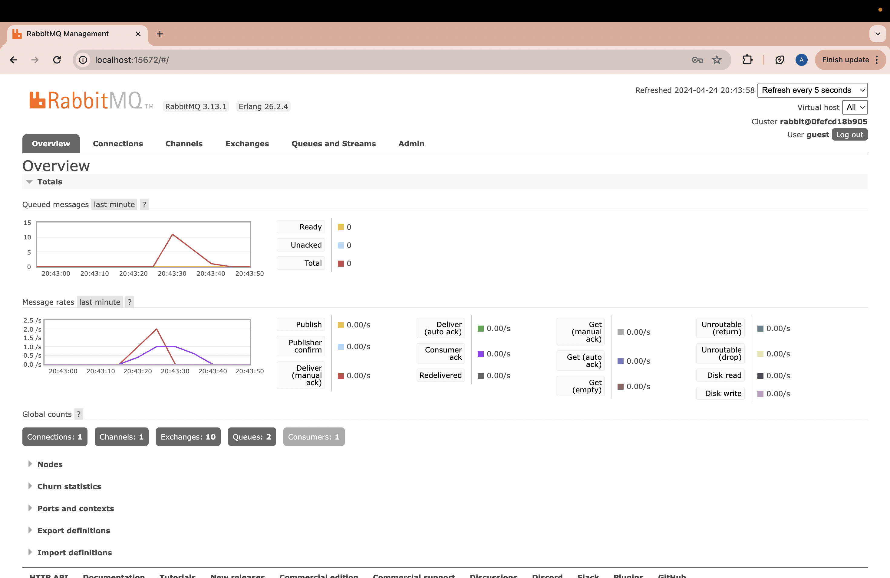
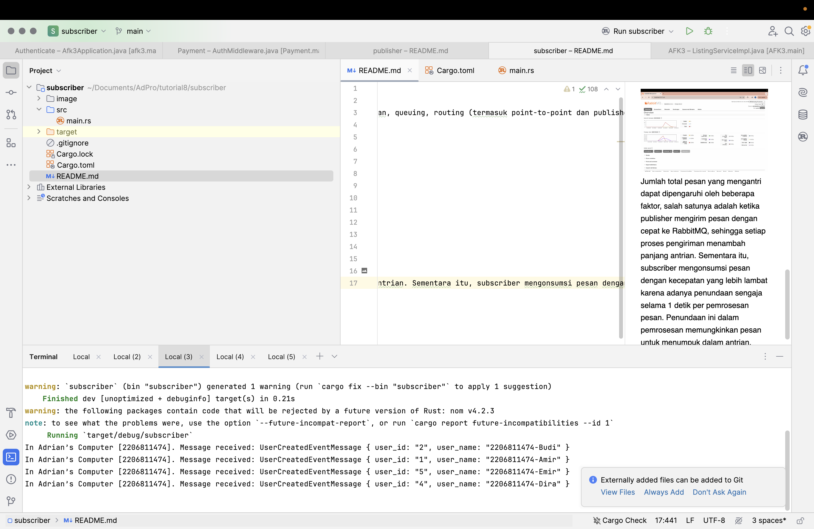
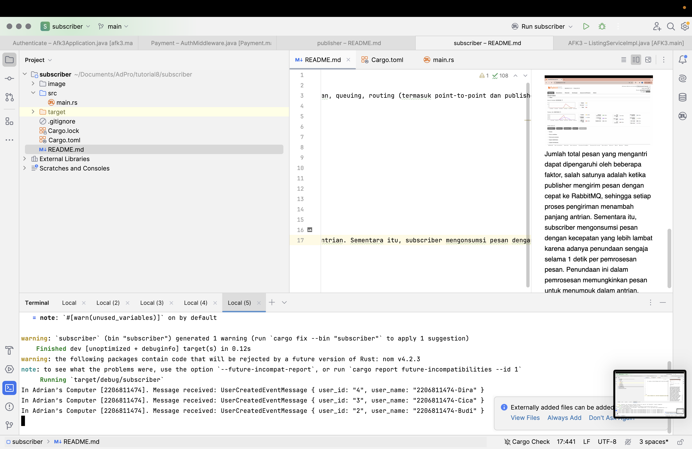
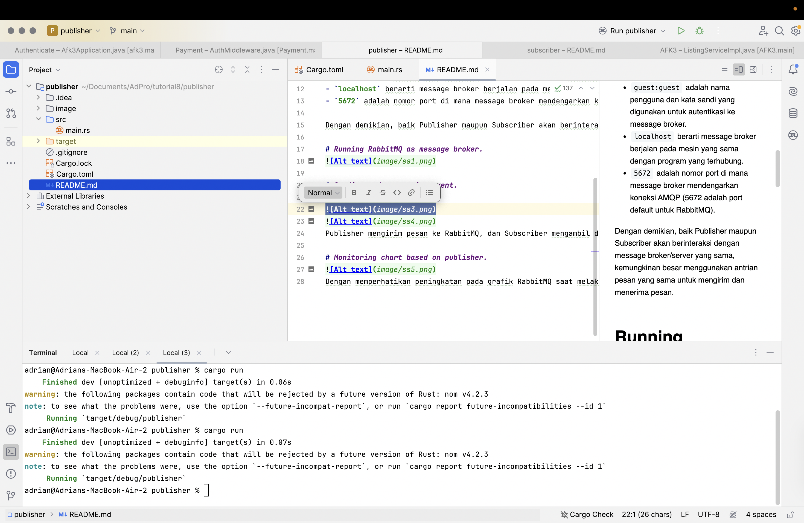
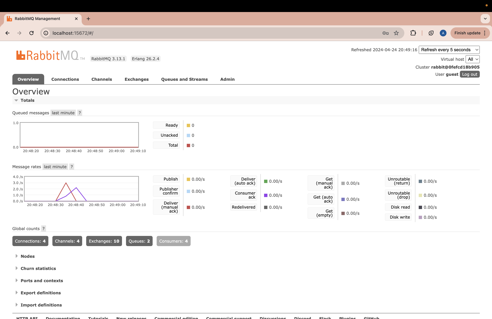

1. What is AMQP?

AMQP adalah singkatan dari Advanced Message Queuing Protocol. Ini adalah protokol lapisan aplikasi standar terbuka untuk middleware berorientasi pesan. Fitur-fitur yang menentukan AMQP adalah orientasi pesan, queuing, routing (termasuk point-to-point dan publisher-and-subscriber), keandalan, dan keamanan.

2. what it means? guest:guest@localhost:5672 , what is the first quest, and what is
   the second guest, and what is localhost:5672 is for?
- `guest` (pertama) adalah nama pengguna untuk autentikasi.
- `guest` (kedua, setelah tanda titik dua `:`) adalah kata sandi untuk autentikasi.
- `localhost:5672` merujuk pada alamat dan port di mana message broker AMQP (seperti RabbitMQ) mendengarkan koneksi.
- `localhost` berarti message broker berjalan pada mesin yang sama dengan klien yang mengakses.
- `5672` adalah nomor port default yang digunakan oleh RabbitMQ untuk menerima koneksi AMQP.

Jadi, string `guest:guest@localhost:5672` digunakan untuk mengakses sebuah message broker AMQP yang berjalan di mesin lokal menggunakan kredensial default `guest:guest` melalui port standar `5672`.

 # Simulation slow subscriber

Jumlah total pesan yang mengantri dapat dipengaruhi oleh beberapa faktor, salah satunya adalah ketika publisher mengirim pesan dengan cepat ke RabbitMQ, sehingga setiap proses pengiriman menambah panjang antrian. Sementara itu, subscriber mengonsumsi pesan dengan kecepatan yang lebih lambat karena adanya penundaan sengaja selama 1 detik per pemrosesan pesan. Penundaan ini dalam pemrosesan memungkinkan pesan untuk menumpuk dalam antrian.

# Reflection and Running at least three subscribers

Ketika beberapa subscriber memproses pesan secara bersamaan, peningkatan dalam panjang antrian pesan akan berkurang lebih cepat karena adanya pemrosesan paralel dan peningkatan throughput. Dengan setiap subscriber menangani pesan secara independen, beban kerja tersebar lebih merata di seluruh sistem, mengurangi kemungkinan antrean menjadi panjang dan memungkinkan lebih banyak pesan diproses secara bersamaan.
